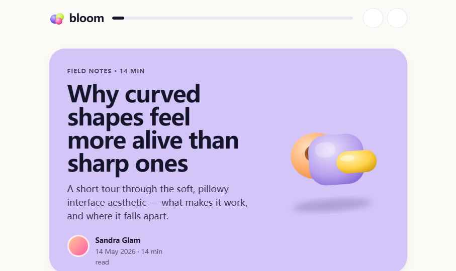
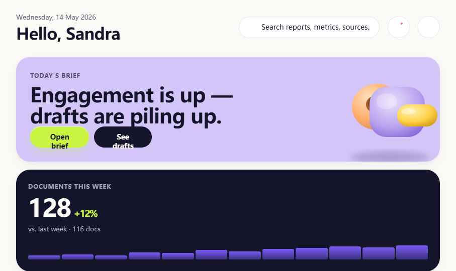
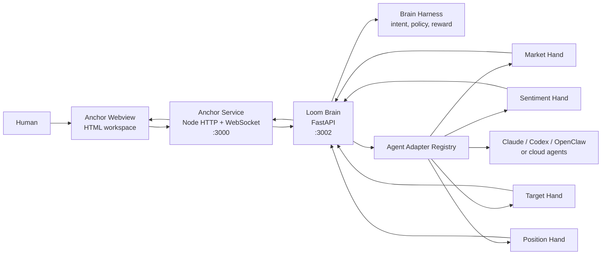
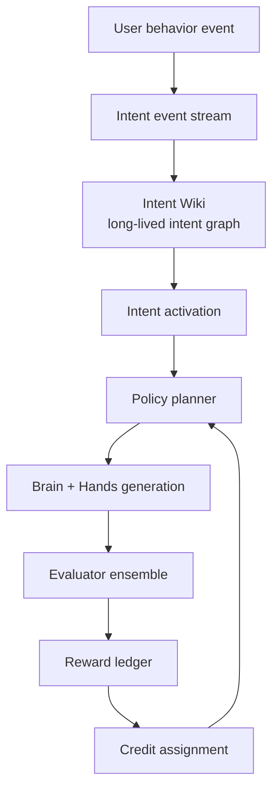

<p align="center">
  
</p>

<h1 align="center">Loom</h1>

<p align="center">
  <strong>An AI-native workspace where the document is the interface.</strong>
  <br>
  Every block is addressable. Every agent action is visible. Every useful behavior can become policy.
</p>

<p align="center">
  <a href="https://tools-only.github.io/Loom/demo.html"></a>
  <a href="docs/loom-hand-agent-guide.md"></a>
  <a href="docs/superpowers/specs/2026-06-09-rewarded-intent-harness-architecture.html"></a>
  
</p>

<p align="center">
  <a href="https://tools-only.github.io/Loom/demo.html">Live demo</a>
  |
  <a href="docs/loom-hand-agent-guide.md">Hand agent guide</a>
  |
  <a href="docs/superpowers/specs/2026-06-09-rewarded-intent-harness-architecture.html">Rewarded intent harness</a>
</p>

<p align="center">
  
</p>

Loom turns generated HTML into a live human-agent workspace. Ask for a report, dashboard, memo, market brief, canvas, or prototype; Loom renders it as structured HTML. Every meaningful block is annotated with stable anchors, so you can click a section and ask an agent to refine, expand, branch, restructure, or annotate only that part.

The long-term goal is not another chat wrapper. Loom is an experiment in **agentic work surfaces**: documents that remember intent, route work to specialist agents, evaluate results, and improve the policies that decide what happens next.

## Product Ideas

<table>
  <tr>
    <td width="50%">
      <h3>Interactive AI documents</h3>
      <p>Generated reports are not dead text. They are HTML workspaces with stable anchors, local operations, provenance, and patchable sections.</p>
    </td>
    <td width="50%">
      <h3>Brain-Hand agents</h3>
      <p>Brain orchestrates workflows. Hands perform domain work. Artifacts flow back into the document instead of disappearing into chat history.</p>
    </td>
  </tr>
  <tr>
    <td width="50%">
      <h3>Intent-aware workspace</h3>
      <p>User behavior becomes structured intent: which block was edited, what resource was added, what goal was repeated, and which preference should persist.</p>
    </td>
    <td width="50%">
      <h3>Rewarded harness</h3>
      <p>Loom tracks selected policies, evaluates output quality, writes reward signals, and updates external agent policy weights without training closed LLM weights.</p>
    </td>
  </tr>
</table>

## What You Can Build With It

<table>
  <tr>
    <td><strong>Research brief</strong><br>Generate a market, technical, or strategy report and refine any section in place.</td>
    <td><strong>Agent dashboard</strong><br>Route one task to multiple specialist agents, then synthesize their artifacts.</td>
  </tr>
  <tr>
    <td><strong>Canvas workspace</strong><br>Turn AI output into cards on a freeform board, then edit selected cards with context.</td>
    <td><strong>Policy-learning harness</strong><br>Record episodes, reward signals, and credit assignment across Brain, Hands, retrieval, and synthesis.</td>
  </tr>
</table>

## Why This Exists

Most AI tools still treat the conversation as the product. Loom treats the **workspace state** as the product.

```text
Chat UI:
  user message -> assistant answer -> scrollback

Loom:
  user intent -> anchored workspace -> local edits -> agent envelopes
              -> specialist artifacts -> Brain synthesis -> learned harness signals
```

In Loom, the user does not need to restate context every time. The system can see which block you touched, which resource you added, which section you kept refining, which agent produced useful claims, and which long-lived intent should influence the next generation.

## Demo

The public demo is a static interactive preview:

[https://tools-only.github.io/Loom/demo.html](https://tools-only.github.io/Loom/demo.html)

It shows an AI-generated market research report rendered with Loom's Bloom design system. Hover over sections and KPI cards to see the operations that a connected agent can perform.

## Visual Tour

<table>
  <tr>
    <td width="50%">
      
      <br>
      <strong>Document as interface</strong>
      <br>
      Render AI work as polished, structured HTML instead of scrollback.
    </td>
    <td width="50%">
      
      <br>
      <strong>Workspace as state</strong>
      <br>
      Dashboards, reports, cards, and canvases become patchable work surfaces.
    </td>
  </tr>
</table>

## Core Architecture



### Anchor: HTML as the Interaction Protocol

Loom's webview is not a passive render target. It is an operation surface. Semantic blocks carry anchors and handles:

```html
<section
  class="anc-section anc-section--gc"
  data-anc="analysis.summary"
  data-handles="refine,expand,shorten,annotate">
  <h2>Summary</h2>
  <p data-anc="analysis.summary.text" data-handles="refine,edit">
    ...
  </p>
</section>
```

Available operations include:

`refine` | `expand` | `shorten` | `edit` | `annotate` | `branch` | `restructure` | `lock`

Each browser operation becomes a structured envelope with the target anchor, operation, selected context, render state, and provenance.

### Brain: Orchestration, Not Domain Execution

Brain is responsible for coordination:

- resolve the workflow
- select hands or external agents
- shape task envelopes
- collect artifacts
- synthesize claims
- patch the workspace
- record harness signals

Brain should not directly own domain business logic. Domain work belongs to Hands.

### Hands: Specialist Agents

Hands are independent domain agents. In the current Loom Fin task pack, examples include:

| Hand | Responsibility |
| --- | --- |
| `market` | macro signals, market regime, sector rotation, fresh events |
| `sentiment` | narratives, crowd positioning, sentiment shifts |
| `target` | company or asset thesis, valuation logic, catalysts |
| `position` | portfolio fit, risk, sizing, reversal conditions |

Hands can run through:

- in-process Python SDK adapters
- local subprocess agents such as Claude Code, Codex, or OpenClaw
- cloud agent endpoints that return NDJSON events

See [docs/loom-hand-agent-guide.md](docs/loom-hand-agent-guide.md).

## Intent and Reward Harness

Loom's Brain side is moving beyond memory injection. It now has a first version of a **reward-bearing harness**.



The current implementation is **closed-model RL-lite**. It does not train the LLM weights. Instead, it learns the external agent policy layer:

- which long-lived intents should activate
- which generation policies should be applied
- when to ask for fresh context
- which hands are worth calling
- how to evaluate whether the result satisfied the active intent
- how to update policy weights after an episode

Important files:

| File | Purpose |
| --- | --- |
| `loom/brain_harness/intent_processor.py` | Parses raw behavior into structured intent events |
| `loom/brain_harness/intent_wiki.py` | Maintains a long-lived intent graph |
| `loom/brain_harness/intent_harness.py` | Plans policies, evaluates outputs, writes reward signals |
| `loom/brain_harness/base.py` | Assembles Brain prompts and runs synthesis under selected policies |
| `brain/intent_wiki/` | Persisted intent graph and evidence |
| `brain/intent_harness/` | Policies, episodes, reward ledger, credit assignments |

The design rationale is documented in [the rewarded intent harness architecture](docs/superpowers/specs/2026-06-09-rewarded-intent-harness-architecture.html).

## Quick Start

### Windows

```bat
REM Start Anchor (:3000) and Brain (:3002)
scripts\start-anchor.bat

REM Open the workspace
REM http://localhost:3000

REM Run as an Electron desktop app
npm start
```

### Linux Headless

```bash
# One-time setup
bash scripts/setup-linux.sh

# Start Anchor and Brain
bash scripts/start-anchor.sh

# Open from your browser
# http://localhost:3000
```

Logs:

```text
logs/anchor.log
logs/brain.log
```

## Useful Local URLs

| URL | Purpose |
| --- | --- |
| `http://localhost:3000` | Main Loom workspace |
| `http://localhost:3000/canvas` | Freeform canvas workspace |
| `http://localhost:3002/health` | Brain health check |
| `http://localhost:3002/intent-stream` | Intent stream, intent graph, rewarded harness panel |
| `http://localhost:3002/intent-graph/data` | Long-lived intent graph JSON |
| `http://localhost:3002/intent-harness/data` | Policy and reward snapshot JSON |

## Repository Map

```text
bridge/webview/          Browser workspace UI, Anchor client, Canvas client
mcp/                     Anchor service and MCP shim
electron/                Desktop shell
loom/                    Python Brain service and hand runtime
loom/brain_harness/      Brain state, intent, policy, reward, synthesis harness
loom_core/               Core runtime, adapters, agent orchestration contracts
hands/                   Per-hand workspaces and persistent hand context
skills/                  Brain and hand skill packs
brain/                   Brain personal state, intent wiki, reward ledgers
docs/                    Architecture notes, hand guide, design references
```

## Development Checks

```bash
# JavaScript syntax
node --check bridge/webview/anchor-client.js
node --check bridge/webview/canvas-client.js

# Existing Node regression tests
node --test bridge/webview/timing-waterfall.test.cjs bridge/webview/styles.regression.test.cjs

# Python syntax on Windows if python alias is broken
D:\conda\python.exe -c "from pathlib import Path; [compile(Path(f).read_text(encoding='utf-8'), f, 'exec') for f in ['loom/brain.py','loom/brain_harness/base.py']]"
```

## Project Status

Loom is an active prototype. The architecture is intentionally local-first and inspectable:

- The workspace is real HTML.
- Agent operations are explicit envelopes.
- Brain and hand responsibilities are separated.
- Intent and reward state is stored on disk as JSON/JSONL.
- Policies are currently deterministic and inspectable rather than hidden model weights.

The next major direction is a deeper Brain-Hand Workflow Harness: hand performance tracking, artifact critics, claim graphs, workflow reward, and better credit assignment across Brain, Hands, retrieval, and synthesis.

## Related Docs

- [Loom Core README](loom_core/README.md)
- [Loom Fin](docs/loom-fin.md)
- [Hand agent guide](docs/loom-hand-agent-guide.md)
- [Rewarded intent harness architecture](docs/superpowers/specs/2026-06-09-rewarded-intent-harness-architecture.html)
- [Harness technical design](docs/loom-harness-technical-design.md)
