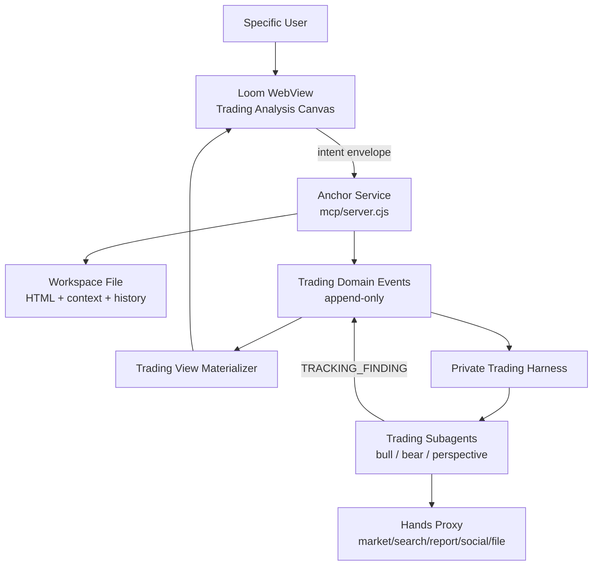

# Loom-Native Private Trading Analysis 功能设计文档 v0.3

## 1. 产品定位

Private Trading Analysis 是 Loom 内的一个私人交易分析 workspace，而不是独立交易 App。

用户在 Loom 的 HTML Canvas 中记录交易想法、交易理由、持仓状态、情绪状态、agent 追踪结果与交易复盘。Agent 围绕每条交易理由形成 claim，并通过正方、反方、多视角 subagent 持续追踪证据。所有业务事实以 append-only domain events 记录，HTML Canvas 只是当前状态的可交互投影。

MVP 只服务 specific user / 私人持仓分析。Social / Broadcast 场景暂不进入实现。

### 1.1 核心目标

MVP 要跑通以下私人协同闭环：

```text
human reasoning
  -> claim extraction
  -> subagent tracking
  -> human reaction
  -> trade / outcome feedback
  -> session replay
```

系统不替用户做交易决策，而是帮助用户把完整判断链路沉淀下来：

- 用户为什么想买、卖、加仓、减仓或观望
- 每条理由来自哪里
- 当时有什么预期、情绪、外部信息、行业经验或私人渠道信息
- Agent 如何持续追踪每条理由
- 正方、反方、多视角 subagent 如何提供支持或反驳线索
- 用户如何接受、反驳、忽略或修正这些线索
- 最终交易结果如何验证或证伪当初的判断

### 1.2 非目标

MVP 不做：

- 社交媒体开放用户推送系统
- 点赞、评论、转发、收藏等 social reward
- L1-L4 内容层级
- 固定栏目、日报、周报等内容产品规则
- 自动交易或券商下单
- 明确买入、卖出、加仓、清仓建议
- 复杂 RL 训练

MVP 只记录 reward-relevant events，为后续 harness 演进提供数据资产。

## 2. 与 Loom 当前架构的关系

本功能应深度复用 Loom 现有架构：

- Anchor Service: `mcp/server.cjs`
- WebView Client: `bridge/webview/anchor-client.js`
- Intent Envelope: `mcp/schemas/intent-envelope.json`
- Workspace file: `logs/workspace/workspace.json`
- Anchor session log: `logs/sessions/*/events.jsonl`

当前 Loom 已具备：

- HTML 作为人机共享语言
- `data-anc` / `data-handles` anchor protocol
- WebView 到 Anchor Service 的 intent envelope
- Anchor session event log
- `anchor_emit_event`
- `anchor_replay_session`
- Workspace file history
- Per-anchor subagent routing
- `.claude/agents` subagent manifest

因此本功能不应另起一套普通 SaaS 后台，而应成为 Loom 的一组 domain extension：

```text
Loom Workspace File
  -> Trading Canvas HTML
  -> Anchor Intent Envelope
  -> Trading Domain Events
  -> Trading Materialized View
  -> Trading Subagents
```

## 3. 三层 Session 模型

### 3.1 Anchor Session

Anchor session 是 Loom 平台层 session，记录系统运行期间的人机交互过程。

示例事件：

- `system.session_start`
- `user.intent`
- `agent.render`
- `agent.decision`
- `agent.complete`

存储位置：

```text
logs/sessions/*/events.jsonl
```

Anchor session 主要用于平台审计、交互 replay 和调试。

### 3.2 Workspace File

Workspace file 是用户在 Loom 中看到和编辑的文件。

它保存：

- 当前 Trading Canvas HTML
- 文件标题
- 文件 history
- 当前 context bundle
- 用户选择的 subagent / resource / skill 配置

交易分析系统的一个自然使用方式是：

```text
Workspace File = 一个标的 / 一次交易想法 / 一个持仓周期的交易分析画布
```

### 3.3 Trading Collaboration Session

Trading session 是业务域 session。

它对应：

- 一次具体交易想法
- 一个标的的持仓周期
- 一个长期观察主题

Trading session 有自己的 `trading_session_id`，并通过 domain events 记录业务事实。

Anchor session 记录“用户和 agent 如何操作 Loom”；Trading session 记录“交易分析业务事实发生了什么”。

二者通过以下字段关联：

- `anchor_session_id`
- `workspace_file_id`
- `trading_session_id`
- `event_id`
- `parent_event_id`

## 4. 核心架构



## 5. 用户流程

### 5.1 创建私人交易分析画布

用户在 Loom 中创建一个 Trading Workspace File。

初始 Canvas 包含：

- 交易意图区
- 原始 reasoning 区
- claim 列表区
- tracking threads 区
- reaction 区
- position / outcome 区
- postmortem 区

初始 anchor 结构：

```html
<section data-anc="trade.intent" data-handles="edit,refine,annotate"></section>
<section data-anc="reasoning.raw" data-handles="edit,expand,annotate"></section>
<section data-anc="claims" data-handles="expand,restructure"></section>
<section data-anc="tracking" data-handles="expand,restructure"></section>
<section data-anc="reactions" data-handles="expand,annotate"></section>
<section data-anc="position.outcome" data-handles="edit,annotate"></section>
<section data-anc="postmortem" data-handles="edit,expand"></section>
```

### 5.2 记录交易理由

用户输入：

- 标的
- 操作意图: `buy / sell / hold / watch / add / reduce`
- 时间窗口
- 持仓上下文
- 原始自由文本
- 情绪状态
- 多条理由及来源

系统生成：

```text
trading.reasoning_declared
trading.claim_extracted
```

每条理由变成一个 claim，并在 Canvas 上形成独立 anchor：

```html
<article
  data-anc="claim.claim_001"
  data-claim-id="claim_001"
  data-handles="refine,annotate,branch,ask">
</article>
```

### 5.3 启动追踪线程

用户或 harness 可为某条 claim 启动 tracking thread。

默认线程：

- `bull`: 寻找支持证据
- `bear`: 寻找反驳证据
- `perspective`: 寻找复杂化视角

事件：

```text
trading.subagent_spawned
```

Canvas anchor：

```html
<section data-anc="thread.claim_001.bull"></section>
<section data-anc="thread.claim_001.bear"></section>
<section data-anc="thread.claim_001.perspective"></section>
```

### 5.4 Subagent 写入 Finding

Subagent 输出必须绑定 claim。

事件：

```text
trading.finding_added
```

Finding 必须包含：

- `claim_id`
- `stance`: `supports / rebuts / complicates`
- `summary`
- `evidence`
- `observed_at`
- `uncertainty`
- `impact_on_claim`

Finding 不允许直接输出买卖建议。

### 5.5 用户反馈

用户可以对 finding 或 claim 做反应：

- `ACCEPT`
- `REBUT`
- `IGNORE`
- `UPDATE_CLAIM`
- `ADD_CLAIM`
- `EXECUTE_TRADE`
- `UNWIND`
- `POSTMORTEM_NOTE`
- `STOP_THREAD`
- `RESTART_THREAD`

事件：

```text
trading.human_reaction
trading.claim_updated
trading.trade_executed
trading.position_unwound
trading.postmortem_added
```

Reaction 可以带自由文本，也可以为空。忽略和沉默本身也是信号。

## 6. 功能模块

### 6.1 Trading Canvas Template

职责：

- 提供初始 HTML Canvas
- 使用 Loom `data-anc` 协议
- 每个业务对象都有稳定 anchor
- 支持局部 patch
- 不强制全页重绘

核心 anchor：

```text
trade.intent
reasoning.raw
claims
claim.{claim_id}
tracking
thread.{claim_id}.bull
thread.{claim_id}.bear
thread.{claim_id}.perspective
reaction.{claim_id}
position.outcome
postmortem
```

建议所有交易域 anchor 增加 domain metadata：

```html
data-domain="trading.private"
data-trading-session-id="trd_..."
data-claim-id="claim_..."
data-finding-id="finding_..."
```

### 6.2 Trading Domain Event Layer

职责：

- 在 Anchor event log 之上记录交易领域事件
- 所有事件 append-only
- 所有事件带 `trading_session_id`
- 所有事件默认 `visibility: private`

统一 envelope：

```ts
type TradingEvent = {
  event_id: string
  trading_session_id: string
  anchor_session_id: string
  workspace_file_id: string
  kind: string
  timestamp: string
  actor: "human" | "harness" | "subagent" | "system"
  parent_event_id?: string
  visibility: "private"
  payload: unknown
}
```

事件类型：

```text
trading.session_started
trading.reasoning_declared
trading.claim_extracted
trading.subagent_spawned
trading.finding_added
trading.human_reaction
trading.claim_updated
trading.trade_executed
trading.position_unwound
trading.postmortem_added
trading.policy_rejected
```

### 6.3 Claim Graph

职责：

- 从用户 reasoning 中形成 claim
- 维护 claim 状态演化
- 为 subagent 提供追踪锚点

Claim 类型：

```ts
type Claim = {
  claim_id: string
  trading_session_id: string
  source_event_id: string
  text: string
  original_text: string
  source_type:
    | "agent_analysis"
    | "external_report"
    | "private_network"
    | "industry_experience"
    | "social_signal"
    | "intuition"
    | "emotion"
    | "other"
  direction?: "bullish" | "bearish" | "neutral" | "unclear"
  time_horizon?: string
  expected_observable?: string
  status: "active" | "strengthened" | "weakened" | "replaced" | "abandoned"
  privacy: "private"
}
```

Claim 状态只能通过事件演化，不能直接覆盖。

### 6.4 Trading Materializer

职责：

- 从 `trading.*` events replay 当前业务状态
- 生成或 patch Trading Canvas HTML
- 保证 HTML 是业务事件的投影，不是唯一事实源

Materialized state 包含：

- claim list
- claim status
- finding list
- reaction history
- thread state
- position / outcome summary
- postmortem timeline

Materializer 输出两类结果：

```ts
type MaterializeResult =
  | { mode: "full_render"; html: string }
  | { mode: "patches"; patches: Array<{ anchor_id: string; html_fragment: string }> }
```

### 6.5 Trading Subagents

通过 Loom 现有 subagent routing 接入。

建议定义：

```text
.claude/agents/trading-bull.md
.claude/agents/trading-bear.md
.claude/agents/trading-perspective.md
```

职责：

- 读取 claim 上下文
- 通过 Hands Proxy 获取信息
- 追加 finding
- 不直接改写用户原始 reasoning
- 不输出直接交易建议

Subagent 输出应转化为 `trading.finding_added`，再由 materializer patch 对应 thread anchor。

### 6.6 Hands Proxy

职责：

- 统一封装外部工具能力
- 隔离 API key、凭证和交易权限
- 给 subagent 提供可审计的工具调用结果

MVP 先 mock：

```ts
type HandsProxy = {
  search(query: string): Promise<SearchResult[]>
  marketData(ticker: string): Promise<MarketSnapshot>
  readReport(source: string): Promise<ReportSummary>
}
```

后续可扩展：

- 行情数据
- 新闻搜索
- 研报阅读
- 社媒舆情
- 文件和笔记
- 用户自有数据

### 6.7 Policy Gate

在写入 `trading.finding_added` 前校验。

检查项：

- 必须绑定 `claim_id`
- 必须声明 stance
- 必须包含 evidence 或 observed_at
- `visibility` 必须是 private
- 不允许直接买卖建议
- 不允许把私人信息写入 broadcast namespace

失败时写入：

```text
trading.policy_rejected
```

## 7. Intent Envelope 扩展

现有 Loom intent envelope 不应被替换，只需增加可选 domain 字段。

建议扩展：

```ts
type TradingDomainEnvelope = {
  namespace: "trading.private"
  action:
    | "DECLARE_REASONING"
    | "EXTRACT_CLAIMS"
    | "SPAWN_TRACKER"
    | "ADD_FINDING"
    | "REACT_TO_FINDING"
    | "UPDATE_CLAIM"
    | "EXECUTE_TRADE"
    | "UNWIND"
    | "POSTMORTEM"
  trading_session_id: string
  claim_id?: string
  finding_id?: string
}
```

完整 envelope 示例：

```ts
type IntentEnvelope = {
  schema_version: "1.0"
  intent: {
    op: "edit" | "annotate" | "ask" | "custom"
    target_kind: "anchor" | "selection" | "global"
    target_ref: string
    instruction?: string
  }
  domain?: TradingDomainEnvelope
  selection?: unknown
  context_bundle: unknown
  render_state: unknown
  provenance: {
    session_id: string
    event_id: string
    parent_event_id?: string | null
    timestamp: string
    client_version: string
  }
}
```

## 8. MVP 迭代路径

### Phase 1: Trading Canvas Template

交付：

- 新建 Trading Canvas HTML 模板
- 支持 trade intent、raw reasoning、claims、tracking、reaction、postmortem 区域
- 所有区域有稳定 `data-anc`

验收：

- 用户能在 Loom 中看到并局部编辑交易分析画布
- 画布符合 Bloom Design System
- 不引入独立前端框架

### Phase 2: Domain Events

交付：

- 定义 `trading.*` event kinds
- 将交易动作写入 Anchor session log
- 所有事件带 `trading_session_id`

验收：

- 能 replay 某个 trading session 的完整事件链
- 业务事件不依赖当前 HTML 才能解释

### Phase 3: Claim Extraction

交付：

- 初版用半结构化输入
- 用户逐条填写理由
- 每条理由生成 claim

验收：

- 原始文本保留
- 每条 claim 有独立 anchor 和状态
- Claim 状态变化通过事件表达，不覆盖旧 claim

### Phase 4: Mock Tracking

交付：

- bull / bear / perspective mock finding
- finding 写入 domain event
- materializer 更新对应 thread

验收：

- finding 必须绑定 claim
- UI 能按 claim 展示支持、反驳、复杂化线索
- finding 不包含直接买卖建议

### Phase 5: Reaction & Replay

交付：

- 用户对 finding 做反应
- 支持 `UPDATE_CLAIM / EXECUTE_TRADE / UNWIND / POSTMORTEM_NOTE`
- replay view 展示完整链路

验收：

- 能复盘“为什么交易、agent 追踪了什么、用户如何更新、结果如何”
- 能看到每条 claim 的状态演化
- 能看到哪些 finding 出现在交易动作前

### Phase 6: Real Subagents + Hands Proxy

交付：

- 接入 trading subagents
- 外部数据通过 Hands Proxy
- finding 写入前经过 Policy Gate

验收：

- subagent 不直接接触凭证
- 不输出直接交易建议
- 私人信息不泄漏到 public path

## 9. 测试场景

### Scenario 1: 完整建仓理由记录

用户输入：

- 标的: TSLA
- 意图: watch / buy
- 理由: 估值回落、交付数据可能改善、朋友提到供应链恢复、自己有 FOMO
- 情绪: 焦虑但兴奋

预期：

- 保存 raw text
- 生成多条 claim
- 每条 claim 保留 source_type
- Canvas 上出现 claim anchor

### Scenario 2: 正反方追踪

对 claim “交付数据可能改善”：

- bull finding 找到支持证据
- bear finding 找到反驳证据
- perspective finding 指出周线和日线视角冲突

预期：

- 三条 finding 都绑定同一 claim
- evidence 可追溯
- 不出现买卖建议

### Scenario 3: 用户修正判断

用户接受 bear finding，并更新 claim：

```text
交付可能改善，但价格竞争会抵消利润率。
```

预期：

- 原 claim 不被覆盖
- 新增 `trading.claim_updated`
- claim view 显示状态变化

### Scenario 4: 交易执行与复盘

用户执行交易，之后平仓并写 postmortem。

预期：

- `trading.trade_executed`
- `trading.position_unwound`
- `trading.postmortem_added`
- Replay view 能展示完整链路

### Scenario 5: 隐私边界

用户输入私人渠道信息和情绪。

预期：

- `visibility` 永远是 private
- 不存在 public / broadcast event
- 没有 social reward 逻辑

## 10. 实现默认假设

- MVP 只做 private harness。
- Social / Broadcast 只作为未来独立路径，不进入本轮实现。
- 初版 claim extraction 可以是人工 / 半结构化，不必马上接 LLM。
- 初版 subagent 可以是 mock，先打通事件流。
- 所有状态变化通过 append-only events 表达。
- 产品层可以展示摘要，但底层必须能 replay 原始事件。
- Agent 永不输出直接交易建议，只输出证据、反证、风险变化和 claim 状态变化。

## 11. Vibe Coding 指导 Prompt

### 11.1 总体实现 Prompt

```text
Implement a Loom-native private trading analysis workspace.

Do not build a standalone trading app.
Extend the existing Loom Anchor architecture:
- Anchor Service in mcp/server.cjs
- WebView HTML canvas in bridge/webview
- intent envelopes in mcp/schemas/intent-envelope.json
- append-only Anchor session logs in logs/sessions

Add a trading.private domain layer:
- Trading Canvas template with data-anc anchors
- trading.* append-only domain events
- claim graph materialized from events
- mock bull / bear / perspective tracking findings
- human reactions
- replayable private trading session

Do not implement social/broadcast mode.
Do not implement auto-trading.
Do not output buy/sell advice.
```

### 11.2 Phase 1 Prompt

```text
Create a Trading Canvas template for Loom.
Use existing Bloom Design System classes.
Every major region must have stable data-anc anchors:
trade.intent, reasoning.raw, claims, tracking, reactions, position.outcome, postmortem.
Each claim and tracking thread must be represented as its own anchor.
```

### 11.3 Phase 2 Prompt

```text
Add a trading.private domain event layer on top of existing Anchor sessions.
Define trading.* event kinds and append them to the existing session event log.
Every event must include trading_session_id, workspace_file_id, actor, visibility private, timestamp, and payload.
Do not add update/delete event APIs.
```

### 11.4 Phase 3 Prompt

```text
Implement semi-structured claim extraction.
The user can enter raw reasoning and multiple reason lines.
Preserve raw_text exactly.
Each reason becomes a private Claim with source_type, direction, time_horizon, status active, and a stable claim_id.
Render each claim into the Trading Canvas as data-anc="claim.{claim_id}".
```

### 11.5 Phase 4 Prompt

```text
Implement mock tracking threads.
For each active claim, create bull, bear, and perspective thread anchors.
Allow mock findings to be appended as trading.finding_added events.
Every finding must bind to a claim_id, have stance, summary, evidence, observed_at, uncertainty, and impact_on_claim.
Reject findings with direct buy/sell advice.
```

### 11.6 Phase 5 Prompt

```text
Implement human reactions and replay.
Users can react to findings with ACCEPT, REBUT, IGNORE, UPDATE_CLAIM, ADD_CLAIM, EXECUTE_TRADE, UNWIND, POSTMORTEM_NOTE, STOP_THREAD, RESTART_THREAD.
All reactions are append-only trading events.
Build a materialized replay view showing original reasoning, claims, findings, reactions, trades, unwind, and postmortem.
```

### 11.7 Phase 6 Prompt

```text
Add real trading subagents through Loom's existing subagent routing.
Create trading-bull, trading-bear, and trading-perspective project agents.
Agents should use a Hands Proxy for external tools and must append trading.finding_added events.
Before writing findings, run Policy Gate checks:
claim binding, stance, evidence, timestamp, no direct trading advice, private visibility only.
```

