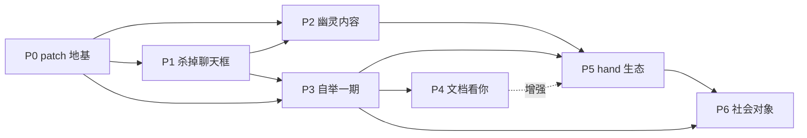

# Loom 架构演进计划（P0–P6）总览

> 本目录是 Loom 从"HTML 工作台"演进为"patch 驱动的人机协作织物"的完整分期方案。
> 每一期一份独立文档，包含需求分析、设计方案、开发拆解、验收标准与风险，供开发直接参考。

---

## 1. 愿景一句话

**没有 shell，只有布（fabric）。**
文档不再是 agent 的产出物，而是宇宙本身：patch 流是它的物理定律，HTML 是它的一种投影，
时间是可导航的维度，信任以元素为粒度空间化呈现，人与 hand 是对称的 patch 源。

## 2. 核心设计原则（全期共用）

1. **一切皆 patch**：任何状态变化（内容、命令、配置、评论、注意力推断）都表达为操作流中的一条 patch。
2. **验证优先**：生成是廉价的，人的信任是稀缺的。每个元素携带出处（provenance），每个动作可逆。
3. **人是一个 hand**：人被建模为高权限、低吞吐、偶尔在线的 patch 源，与 agent 架构对称。
4. **演化走幽灵管道**：系统对自身的任何变更提议（新 hand、退役、折叠）都以 ghost 形式显影，等待批准。
5. **苦涩教训检验**：每个功能问一次——它随模型变强而增值，还是在补偿模型弱点？后者不做。

## 3. 术语表（Glossary）

| 术语 | 定义 |
|---|---|
| **fabric** | 一块"活文档"，由 patch 流折叠而成的块树，可投影为 HTML 等多种视图 |
| **block** | fabric 中的最小可寻址元素（段落、图表、卡片、评论线程等），有状态机与出处 |
| **patch** | 对 fabric 的一次原子操作（insert/update/move/delete/state/command 等），append-only |
| **hand** | 独立 agent 进程，唯一职责是消费命令、产出 patch；runtime 可热插拔（Claude Code / Codex / OpenClaw / cloud） |
| **handle** | 施加在 block 上的八类操作动词：refine / expand / shorten / edit / annotate / branch / restructure / lock |
| **wiki** | hand 的持久化认知库；P3 起自身也渲染为 fabric，可被 handle 编辑 |
| **ghost** | 处于"未来态"的 block：hand 的计划预先显影，凝固前半透明存在 |
| **molten / crystal** | 元素的两种相：即兴生成（热）与已结晶为确定性代码（冷） |
| **织谱 (pattern)** | 可分享的声明式单元：hand 编排 + 文档骨架 + handle 配置，不含数据与 wiki |
| **run** | hand 的一次执行实例，patch 通过 run_id 归因到具体运行 |

## 4. 分期总表

| 期 | 代号 | 一句话目标 | 用户可见性 | 依赖 | 规模参考* |
|---|---|---|---|---|---|
| P0 | 地基期 | 真理源换成 patch 操作流，HTML 降级为投影 | 无（纯底层） | — | 3–5 周 |
| P1 | 弑君期 | 杀掉聊天框，意图表达全部溶解进文档 | 极高 | P0 | 4–6 周 |
| P2 | 显影期 | hand 的计划以幽灵内容预先显影，治理空间化 | 高 | P0, P1 | 3–4 周 |
| P3 | 照镜期 | 自举一期：配置 / 注册表 / wiki 渲染为 fabric | 中 | P0, P1 | 2–3 周 |
| P4 | 凝视期 | 文档反过来看你：注意力成为输入，先落 wiki 再驱动行为 | 中 | P0–P3 | 3–4 周 |
| P5 | 演化期 | hand 生态：度量 → 竞标 → 繁殖与死亡 | 中 | P0–P3（P4 增强） | 4–6 周 |
| P6 | 出海期 | fabric 成为社会对象：织谱 / fork / 认知继承 | 高 | P0–P5 | 4–6 周 |

\* 以 1–2 名熟悉现有代码库的全职工程师估算，不含缓冲。P1 与 P2 必须连续交付（见 §6 风险）。

## 5. 依赖关系图



关键路径：**P0 → P1 → P2**。前三期完成后，Loom 已经与 Claude Code 不在同一物种上；
P3–P6 决定它活多久，不决定它是否成立。

## 6. 全局风险与纪律

1. **P1/P2 不可拆开上线**。杀掉聊天框后用户失去的是 agent 的"进度叙述流"，幽灵内容是其替代品。
   只上 P1 会产生"agent 在黑箱里干活"的恐怖谷期。
2. **P0 禁止贪心上 CRDT**。单机 append-only log 足够支撑到 P6 之前；多端协同是 P6 的子课题。
3. **P1 的退路不是加回聊天框**，而是修 affordance（`/` 菜单与评论线程的可发现性）。范式坚持，手感妥协。
4. **P4/P5 是学习系统**，数据不足时上线只会学到噪声，严禁提前。
5. 每期验收以 **demo 脚本** 为准（各文档末节），不以功能清单打勾为准。

## 7. 技术栈假设（写给读者）

方案默认以下假设，若与实际仓库不符，请以本节为映射表整体替换，不影响设计本身：

- 后端 Python（现有 hand_registry.py 等），新增模块以 Python 包组织；
- 存储 SQLite（单文件、append-only 友好、零运维），预留迁移到 Postgres 的抽象层；
- 前端为现有 HTML 渲染层 + 少量 JS（selection / command palette / ghost 渲染），不强制引入前端框架；
- hand runtime 保持现状：Claude Code / Codex / OpenClaw / cloud 热插拔，本计划不改动 runtime 适配层的对外接口，
  只改动 hand 的**输出协议**（P0：从"改写 HTML"改为"提交 patch"）。

## 8. 文档索引

- [00-p0-patch-foundation.md](./00-p0-patch-foundation.md) — P0 地基期：一切皆 patch
- [01-p1-kill-chatbox.md](./01-p1-kill-chatbox.md) — P1 弑君期：杀掉聊天框
- [02-p2-ghost-content.md](./02-p2-ghost-content.md) — P2 显影期：幽灵内容
- [03-p3-bootstrap.md](./03-p3-bootstrap.md) — P3 照镜期：自举一期
- [04-p4-attention.md](./04-p4-attention.md) — P4 凝视期：文档反过来看你
- [05-p5-hand-ecology.md](./05-p5-hand-ecology.md) — P5 演化期：hand 生态
- [06-p6-social-fabric.md](./06-p6-social-fabric.md) — P6 出海期：fabric 社会对象


# Loom 全局代码架构（P0–P6 模块总图）

> 本文档定义整个演进计划的代码骨架：包结构、每个模块的职责、分期归属与跨模块依赖规则。
> 各期文档的 §7 给出该期模块内部的类/函数级设计，本文档解决"东西放在哪、谁能依赖谁"。

## 1. 包结构总图

```
loom/
├─ core/                 # [P0] patch 引擎——系统唯一地基，禁止依赖其他任何包
│  ├─ ops.py             #   op 协议数据类 + 校验
│  ├─ store.py           #   PatchStore：追加写 / 查询 / 快照
│  ├─ tree.py            #   Block / BlockTree / 状态机
│  ├─ reducer.py         #   fold()：patch 流 → BlockTree（纯函数）
│  ├─ branch.py          #   fork / checkout / 3-way merge
│  └─ api.py             #   HTTP 服务边界（薄层，无业务逻辑）
├─ projection/           # [P0] 投影层：BlockTree → 各种视图
│  ├─ base.py            #   Projector 接口
│  └─ html.py            #   HTML 投影器（稳定 data-block-id 锚点）
├─ handsdk/              # [P0/P1/P2] hand 的唯一输出通道
│  ├─ session.py         #   HandSession：run 生命周期内的 emit_* 家族
│  └─ legacy.py          #   HTML-diff → patch 过渡转换器
├─ router/               # [P1→P5] 命令消费与 run 管理
│  ├─ router.py          #   Router 接口 + v0 写死策略（P5 换 bidding 实现）
│  ├─ runs.py            #   RunManager：起停 / 排队 / 中断
│  └─ stream.py          #   SSE：tree-diff 与状态徽章推送
├─ scheduler/            # [P2] ghost 调度
│  ├─ ghost_index.py     #   从操作流重放构建的待触发索引
│  ├─ triggers.py        #   EventSource 接口 + cron/file/webhook 实现
│  └─ loop.py            #   调度主循环 + 预算/seal 校验
├─ system/               # [P3] 自举：系统状态的 fabric 化
│  ├─ projector.py       #   SystemProjector 接口 + 注册机制
│  ├─ config.py          #   ConfigProjector + ConfigStore
│  ├─ registry.py        #   RegistryProjector（P5 在此挂 metric blocks）
│  ├─ wiki.py            #   WikiStore（条目化）+ WikiProjector
│  ├─ reconciler.py      #   外部改动 → 补录 system patch 的对账器
│  └─ schema/            #   JSON Schema 文件
├─ attention/            # [P4] 注意力管道（严格本地）
│  ├─ store.py           #   attention_events / attention_stats
│  ├─ aggregate.py       #   会话聚合
│  ├─ infer.py           #   规则推断器 → 候选认知
│  └─ privacy.py         #   开关 / 用量 / 一键清除
├─ ecology/              # [P5] hand 生态
│  ├─ metrics.py         #   归因指标（操作流上的纯函数）
│  ├─ bidding.py         #   竞标打分器（Router 的 v1 实现）
│  ├─ mining.py          #   command 流模式挖掘
│  └─ lifecycle.py       #   结晶 / 退役 / 试用期的 ghost 生成器
├─ share/                # [P6] 社会化
│  ├─ bundle.py          #   .loom 打包 / 导入
│  ├─ pattern.py         #   织谱提取 / 实例化
│  ├─ identity.py        #   keypair 签名与校验
│  ├─ sanitize.py        #   消毒会话 + 红线扫描
│  └─ sync.py            #   上游增量 merge
└─ hands/                # 内置 hand（hand_curator 等）与 hand 定义

frontend/
├─ selection.js          # [P1] SelectionManager
├─ palette.js            # [P1] 命令面板 + @补全
├─ slashmenu.js          # [P1] / 菜单
├─ comments.js           # [P1] 页边评论线程
├─ badges.js             # [P1] 元素级运行状态
├─ provenance.js         # [P1] 出处面板
├─ timeline.js           # [P0] 时间轴 / fork UI
├─ ghost.js              # [P2] 幽灵渲染与三操作
├─ attention.js          # [P4] AttentionSDK（采集）
├─ lens.js               # [P4] 注意力透镜
└─ importer.js           # [P6] 导入向导四屏
```

## 2. 依赖规则（架构红线，code review 检查项）

1. `core` 零依赖：不 import loom 内任何其他包；一切业务概念（ghost、wiki、竞标）在 core 眼中只是
   带特定 block_type / meta 的普通 patch。
2. 单向依赖链：`share → ecology → (scheduler, system) → (router, handsdk) → projection → core`。
   反向 import 一律禁止；需要回调时用事件订阅（core 提供 `on_patch_appended` 钩子）。
3. hand 永远只通过 `handsdk` 说话：任何 hand（含内置 hand_curator）不得直接 import core.store。
4. 前端与后端唯一契约是 `core/api.py` 的 HTTP/SSE 接口 + block 的渲染约定（data-block-id、
   block_type→组件映射表），前端不得假设存储细节。
5. 每期新增包必须自带 `README`（一段话职责说明）+ 契约测试；跨包调用只走各包 `__init__` 导出的公共接口。

## 3. 数据流回顾（模块视角）

```
人的手势(frontend) ──command patch──▶ core.store ──钩子──▶ router ──▶ handsdk(run)
                                        │                              │
hand 的产出 ◀──────── emit_patch ───────┼──────────────────────────────┘
                                        ▼
                                  core.reducer ──▶ projection.html ──SSE──▶ 前端增量渲染
scheduler / system / attention / ecology / share：全部只是上图的特殊 producer 或 consumer。
```

## 4. 各期落点速查

| 期 | 新增/主改模块 | 复用 |
|---|---|---|
| P0 | core, projection, handsdk.legacy, frontend/timeline | — |
| P1 | router, frontend/selection·palette·slashmenu·comments·badges·provenance | core, handsdk |
| P2 | scheduler, frontend/ghost, handsdk.emit_plan | core, router |
| P3 | system, hands 的 wiki 协议 | core, scheduler(ghost), frontend/palette(按类型裁剪) |
| P4 | attention, hands/hand_curator, frontend/attention·lens | system.wiki, scheduler(夜间窗口) |
| P5 | ecology（bidding 替换 router.v0 实现） | system.registry, scheduler(ghost), core.branch |
| P6 | share, frontend/importer | core.branch(merge), system.wiki, ecology(角色结晶) |